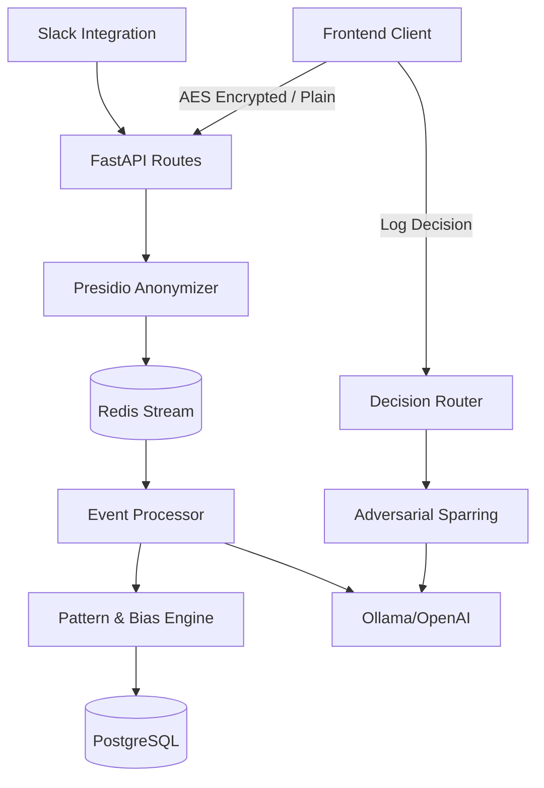

# Architecture Overview: Seedlings AI Co-Founder

Seedlings is designed as a secure, private, and localized AI agent system that acts as a strategic thinking partner for startup founders. 

## System Components

### 1. The React / Vite Frontend
The user-facing application is built on React, using Vite as the bundler. It uses **Tailwind CSS v4** and customized Shadcn UI components adapted for glassmorphism and modern visual aesthetics. The application relies entirely on the local backend; all state is persisted via the backend APIs.

### 2. The FastAPI Backend
The core application server is written in Python (FastAPI). It handles routing, authorization, and orchestration of the various AI sub-systems. 
- **Database**: PostgreSQL handles structured persistent storage (Users, OAuth Tokens, Metrics).
- **In-Memory Pipelines**: Currently, real-time events and decisions are aggressively modeled using in-memory structures (`_events`, `_decisions`) heavily coupled with Redis Streams.

### 3. The Data Ingestion Pipeline (Redis & Workers)
Frictionless ingestion is a core priority of Seedlings.
- **REST API (`/api/events`)**: Receives text/audio from the web application, Slack, Email, and Discord.
- **PII Scrubbing (Presidio)**: Before touching the LLM or any persistent storage, events pass through Microsoft Presidio. Entities like `PERSON`, `LOCATION`, and `PHONE_NUMBER` are anonymized (e.g., `<PERSON>`).
- **Redis Streams**: Incoming scrubbed events are published to a Redis Stream (`founder_events`).
- **Event Processor Worker**: A decoupled background worker (`event_processor.py`) consumes the stream, analyzes the event using the Pattern Engine, and updates the founder's state.

### 4. The AI Cognitive Engines
The intelligence of the platform is modularized into dedicated engine classes:
- **LLM Provider Abstraction (`llm_provider.py`)**: A swappable interface supporting both OpenAI (Cloud, `gpt-4o-mini`) and Ollama (Local/Air-gapped, `aya-expanse:8b`).
- **Pattern Engine (`pattern_engine.py`)**: Analyzes ingested events to identify cognitive biases (e.g., Confirmation Bias, Avoidance, Sunk Cost Fallacy) over a rolling window.
- **Judgment Tracker (`judgment_tracker.py`)**: Computes the Brier score and accuracy metrics by comparing the founder's initial "Expected Outcome" and "Confidence Level" of a Decision against the "Actual Outcome".
- **State-Aware Prompter (`state_aware_prompter.py`)**: Injects the founder's established psychological "Safety/Threat Mode" and recent context into AI system prompts, ensuring responses are deeply personalized.
- **Adversarial Sparring (`adversarial_sparring.py`)**: A Devil's Advocate Socratic engine that monitors "pending" decisions. If a decision has a high confidence score (>80%) but zero logged alternatives, this engine spins up to challenge the founder's assumptions.

### 5. Zero-Trust Security Execution
Seedlings provides an optional local-only, zero-trust mode:
1.  **Frontend Encryption**: Web Crypto API (AES-GCM) encrypts reflections on the client device. The backend stores the cipher.
2.  **Local LLM Execution**: Uses Ollama with standard `GGUF` model weights (e.g. `aya-expanse:8b`, `tinyllama`) executed directly on the host hardware (CPU/GPU) without leaving the machine.
3.  **Local PII Engine**: spaCy and Presidio execute locally, removing identifying markers before prompt compilation.

## Data Flow Diagram

