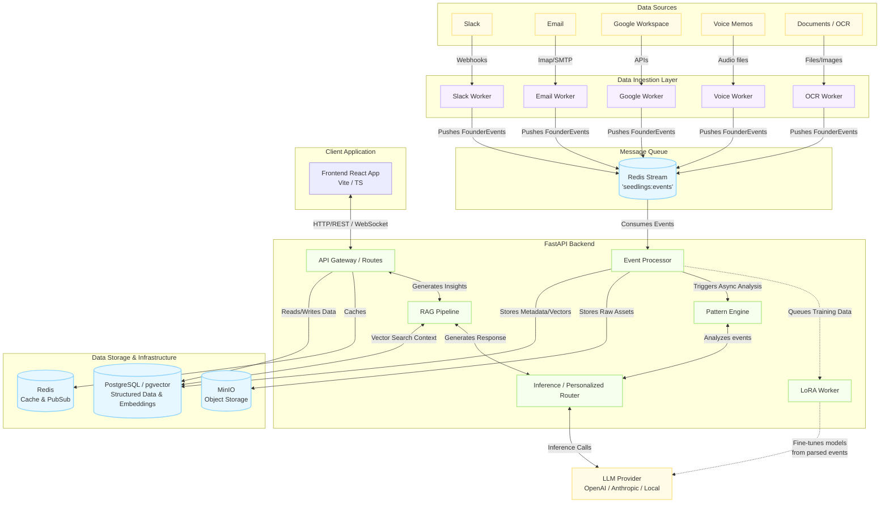

# System Data Flow Diagram

This document illustrates the data flow architecture of the Strategic Thinkers (Seedlings) system, detailing how data moves between ingestion workers, backing infrastructure, backend services, and front-end clients.

